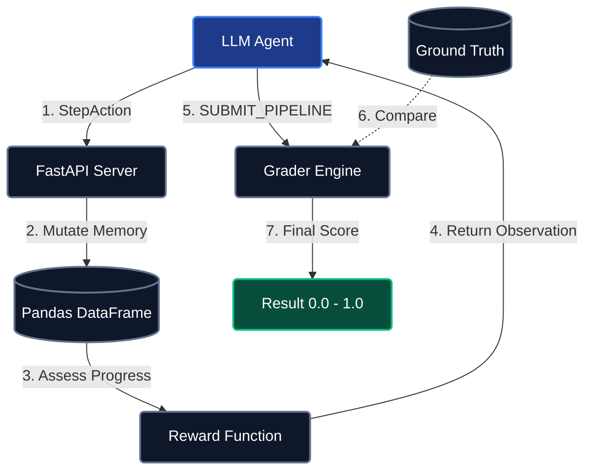

# ⚙️ CRM Data Pipeline Environment

> **A Real-World Autonomous Data Engineering Benchmark**

[](#) [](#) [](#)

---

## 📖 1. Overview & Motivation

The CRM Data Pipeline Environment is a production-grade testbed designed to rigorously evaluate the operational reasoning, multi-step planning, and code-generation capabilities of autonomous AI agents. Unlike standard game environments or toy benchmarks, this repository simulates a high-impact, real-world data engineering workload. The primary objective is to clean, standardize, and unify messy customer datasets coming from disparate enterprise sources.

In real-world enterprise environments, CRM data suffers from formatting inconsistencies, null values, unstructured inputs, and duplicates. Autonomous agents operating in this benchmark must systematically profile datasets retrieved from Salesforce, Web Leads, and Legacy Databases. The agent acts precisely as a human Data Engineer would: applying normalization strategies, executing complex SQL joins, and synthesizing a pristine, analytics-ready master table. 

This environment is built strictly upon the OpenEnv Specification, providing a formalized and reproducible interface for researchers looking to evaluate frontier LLMs executing multi-step data transformations. By shifting focus to enterprise operations, we bridge the gap between AI research and immediate business utility.

---

## 🏗️ 2. Environment Architecture

This environment formally models a Partially Observable Markov Decision Process (POMDP). The agent cannot see the full ground truth instantly; rather, it must infer the state of the data by actively profiling, sampling, and querying the environment block by block.



### 🎯 Reward Signal and Shaping

To conquer the sparse-reward problem typical in code generation environments, this architecture implements a Dense Heuristic Reward strategy. 

Progressive Rewards ranging from +0.03 to +0.05 are awarded immediately for successful data normalization or deduplication steps. This gives the agent a trailing crumb of positive reinforcement as it cleans the pipeline.

Destructive Penalties between -0.1 and -0.5 are strongly deducted for erratic actions, such as producing SQL syntax errors, hallucinating operations, or attempting premature submission. 

Terminal Accuracy Score ranging from 0.0 to 1.0 is scored dynamically at the end of the episode by the internal Grader Engine. The grader uses stringent row-matching and column-matching heuristics against a hidden Ground Truth dataset.

---

## 🕹️ 3. Action Space

Agents express their intentions using a strictly-typed JSON payload serialized directly to the `CRMPipelineAction` Pydantic model. Each action type maps to a concrete data engineering operation.

**VIEW_SOURCE**: The agent retrieves standard markdown table previews of a source to understand data context. It requires the `source` argument.

**PROFILE_SOURCE**: The agent generates a statistical quality report outlining null percentages and data types. It requires the `source` argument.

**STANDARDIZE_COLUMN**: The agent applies deterministic transformations to a chosen column, such as standardizing phone numbers or lowering strings. It requires the `source`, `column`, and `standardization_strategy` arguments.

**HANDLE_MISSING**: The agent resolves null gaps computationally. It requires the `source`, `column`, and `missing_strategy` arguments.

**DEDUPLICATE**: The agent strips duplicate values logically based on semantic keys. It requires the `source` and `deduplication_strategy` arguments.

**EXECUTE_SQL**: The agent performs advanced inner-joins or custom filters using actual SQL execution over the dataframes. It requires the `query` and `output_table` arguments.

**SUBMIT_PIPELINE**: The agent formally concludes the active episode and triggers the final grader evaluation. It requires the `final_source` argument.

> [!TIP]
> **Safety Guardrails:** The `EXECUTE_SQL` operation is protected natively through a strict syntax parser that actively blocks destructive sub-queries like `DROP` or `DELETE`, effectively mitigating SQL injection or state-poisoning attacks within the execution container.

---

## 👁️ 4. Observation Space

After every executed environment step, the internal server evaluates the mutation and returns a robust `CRMPipelineObservation` object representing the updated POMDP configuration.

```json
{
  "current_task_objective": "Formal string denoting the exact instruction set.",
  "schema_target": {"email": "str", "phone": "int"},
  "available_sources": ["salesforce", "web_leads"],
  "current_view": "| id | email | ...",
  "data_quality_report": "Missing values detected in 14% of fields...",
  "last_action_feedback": "Successfully dropped 5 duplicates based on EXACT_EMAIL."
}
```

---

## 📋 5. Task Catalogue

The environment dynamically spawns three increasingly complex evaluation tasks as delineated in `openenv.yaml`. This ensures a meaningful progression of difficulty.

**🟢 Task 1 (Easy): Web Forms Normalization**
The agent cleans a single operational dataset. It must fix date formats mathematically, standardize email casing, and strip trailing white spaces safely.

**🟡 Task 2 (Medium): Legacy DB Deduplication**
The agent standardizes and merges `web_forms` and `legacy_db` tables. It has to handle erratic schemas and resolve conflicting uniqueness constraints seamlessly.

**🔴 Task 3 (Hard): 3-Way Enterprise Merge**
The agent standardizes `salesforce`, `web_leads`, and `legacy_db`. The complexity ceiling is reached here, as the agent must orchestrate dynamic `EXECUTE_SQL` aggregation queries to merge overlapping attributes while actively filtering out bot-injected outlier rows.

---

## ⚡ 6. Setup & Installation

**Option A: Local Execution (Native Python)**
A developer can test the suite directly. Ensure the `uv` package manager and `openenv-core` are available. Clone the repository and install dependencies natively using `uv run -m server.app`.

**Option B: Containerized Execution (Docker)**
The environment ships with a production-ready OpenEnv Dockerfile. Execute `docker build -t crm-pipeline-env .` followed by `docker run -p 8080:8080 crm-pipeline-env`. Once instantiated, the environment responds directly to the `/reset`, `/step`, and `/state` API specification endpoints seamlessly.

---

## 🚀 7. Baseline Inference & Reproducibility

An out-of-the-box evaluation script named `inference.py` is included natively. This code rigidly aligns with the OpenEnv validation formats and features automated deterministic rule-based fallbacks to guarantee reliability if LLM rate limits restrict live inferences.

**Configuration Guidelines**
Export your required API credentials safely into your environment context before instantiating the baseline tests. We recommend mapping `API_BASE_URL`, `MODEL_NAME`, and `HF_TOKEN` globally.

**Running the Evaluator locally**
Trigger the script using `uv run python inference.py`. This invocation reproduces our published deterministic heuristic baseline across all tiered difficulty levels.

**Verified Baseline Reliability Profile**
The integrated rule-based heuristic framework uniformly yields a 1.0 (100% normalized score) on Task 1, Task 2, and Task 3. This strict standard allows researcher agents to clearly track their delta against deterministic perfection.

