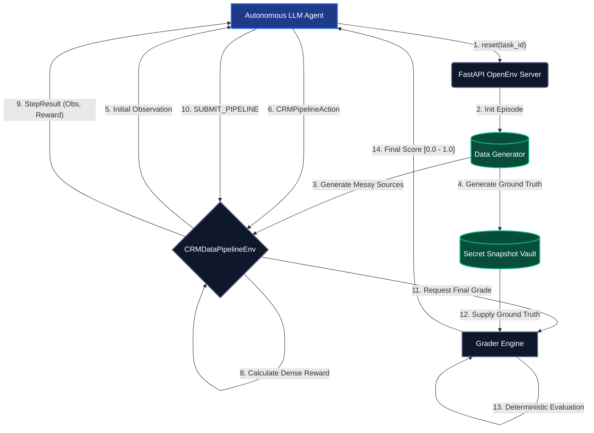

# OpenEnv CRM Data Pipeline Benchmark

## 1. Abstract

The CRM Data Pipeline Environment is a highly specialized, programmatic testbed designed to evaluate the reasoning, planning, and code-generation capabilities of autonomous agents. The environment simulates a rigorous enterprise data engineering workload: retrieving, profiling, standardizing, and merging heterogeneous customer databases (Salesforce, Web Leads, Legacy Databases) into a pristine, unified schema.

This benchmark rigorously adheres to the OpenEnv Specification, exposing standardized `step()`, `reset()`, and `state()` endpoints across an isolated HTTP interface.

---

## 2. System Architecture

The following diagram illustrates the lifecycle of a single episode evaluated by the OpenEnv Server.



---

## 3. Reinforcement Learning (RL) Formalization

To bridge deterministic software engineering with applied AI, this environment strictly models a **Markov Decision Process (MDP)**. Agents interacting with the pipeline are trained/evaluated based on the standard RL tuple: `(S, A, T, R, γ)`.

* **State Space ($S$)**: The discrete global state of the environment, defined as the schema definition, the current data tables loaded in memory, and the active view the agent is analyzing. Because the agent cannot observe the entire `Ground Truth`, the environment functions as a **Partially Observable Markov Decision Process (POMDP)**.
* **Action Space ($A$)**: A finite set of bounded JSON mutations acting upon the dataframe (e.g., standardizing values, filling missing fields, executing SQL inner-joins).
* **Transition Dynamics ($T$)**: The deterministic resulting state of the Pandas dataframe after an action $A_t$ is applied to state $S_t$.
* **Reward Function ($R$)**: A dense heuristic gradient providing immediate signal $R_{t+1}$ on action success, combined with a sparse terminal reward comparing final string matching accuracy.

---

## 4. Action Space

The action space is a strictly typed JSON payload adhering to the `CRMPipelineAction` Pydantic schema. The agent can dispatch the following operations via the `step()` endpoint:

* **`VIEW_SOURCE`**: Retrieves a textual representation of the specified input source dataset (head rows).
* **`PROFILE_SOURCE`**: Generates a statistical data quality report for the target source, identifying missing values, inferred types, and uniqueness constraints.
* **`STANDARDIZE_COLUMN`**: Applies a deterministic transformation to a specific column. Supported strategies include:
  * `LOWERCASE_STRIP`: Lowercase projection with whitespace trimming.
  * `TO_DATETIME_ISO`: Parses arbitrary date strings into ISO-8601 formatting.
  * `EXTRACT_NUMBERS`: Retains only numeric characters (e.g., standardizing phone numbers).
* **`HANDLE_MISSING`**: Resolves NaN/Null fields using imputation (`FILL_VALUE`) or row deletion (`DROP_ROW`).
* **`DEDUPLICATE`**: Implements logical deduplication based on strict criteria (e.g., `EXACT_EMAIL`).
* **`EXECUTE_SQL`**: Allows the agent to construct custom SQLite queries to perform complex joins or unions. The environment rigidly parses the syntax to prevent SQL injection and state poisoning (blocking `DROP` or `DELETE` operators).
* **`SUBMIT_PIPELINE`**: Concludes the episode, signaling the grader to evaluate the final specified output dataframe.

---

## 5. Observation Space

Upon initialization or after successfully processing an action, the environment returns a `CRMPipelineObservation` object detailing the current POMDP configuration:

* **`current_task_objective`** *(string)*: Formal declaration of the agent's goal for the episode.
* **`schema_target`** *(dict)*: The expected column topology for the final output table.
* **`available_sources`** *(list)*: Enumeration of currently available input tables.
* **`current_view`** *(string)*: A rendered Markdown table representing the state of the active source dataset.
* **`data_quality_report`** *(string)*: Output statistics stemming from a prior `PROFILE_SOURCE` action.
* **`last_action_feedback`** *(string)*: Detailed status or stack trace derived from the execution of the previous step.

---

## 6. Reward Design

To combat the sparse reward problem commonly found in data manipulation tasks, the environment implements a rigorously shaped dense reward signal:

* **Heuristic Progress ($+0.03 \to +0.05$)**: Awarded sequentially for successful intermediate cleaning actions (e.g., proper execution of `STANDARDIZE_COLUMN` or `DEDUPLICATE`) based on the delta of row conformity.
* **Destructive Operation Penalties ($-0.1 \to -0.5$)**: Deducted for syntax errors in `EXECUTE_SQL`, or for attempting premature submission (failing the `MIN_STEPS` threshold constraint), discouraging random walking policies.
* **Terminal Heuristic Bonus ($+0.2$ max)**: Awarded at terminal state representing the ratio of output columns matching the required `schema_target`.

*Note: The programmatic Grader score ($0.0 \to 1.0$) is mathematically isolated from this immediate environment reward and represents the ultimate validity of the output dataset over the evaluation episode.*

---

## 7. Task Formulation & Evaluation

The environment configures three discrete tasks, increasing geometrically in computational complexity. Evaluation is deterministic: the agent's terminal dataset is stringently compared cell-by-cell against a sequestered `Ground Truth` snapshot generated during `reset()`.

### Task 1: Web Forms Normalization (Easy)
* **Goal**: Process a single `web_forms` dataset.
* **Mechanics**: The agent must identify date formats, normalize email casings, and strip arbitrary whitespace anomalies.

### Task 2: Legacy DB Deduplication (Medium)
* **Goal**: Merge `web_forms` and `legacy_db` sources.
* **Mechanics**: Requires data normalization across two distinct tables followed by a complex deduplication strategy.

### Task 3: 3-Way Source Merge (Hard)
* **Goal**: Unify `salesforce`, `web_leads`, and `legacy_db` silos.
* **Mechanics**: Forces the agent to utilize advanced `EXECUTE_SQL` joins, resolve conflicting primary keys, and dynamically drop bot-injected rows before final compilation.

---

## 8. System Architecture Setup

### Prerequisites
* Python 3.10, 3.11, or 3.12
* Docker (for isolated evaluation)
* OpenEnv Core Framework (`pip install openenv-core`)

### Environment Variables
Configure `.env` prior to running the baseline script:
```env
HF_TOKEN=your_authentication_token
API_BASE_URL=your_llm_inference_endpoint
MODEL_NAME=your_target_model
```

### Local Execution (Python)
Launch the FastAPI backend server on port 8080:
```bash
python -m server.app
```

### Containerized Execution (Docker)
Build and run the verified OpenEnv container:
```bash
docker build -t crm-env .
docker run -p 8080:8080 crm-env
```

---

## 9. Baseline Inference

The repository includes `inference.py`, demonstrating a deterministic rule-based heuristic fallback alongside a standard OpenAI API caller loop.

Execute the baseline directly against the local server to verify execution boundaries:
```bash
python inference.py
```

### Reference Baseline Scores
Executing the inference script yields the following verifiable grade metrics:
* **Task 1 (Easy):** 1.000 / 1.000
* **Task 2 (Medium):** 1.000 / 1.000
* **Task 3 (Hard):** 1.000 / 1.000
